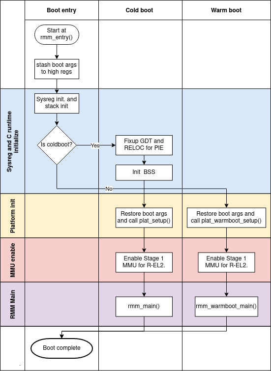

.. SPDX-License-Identifier: BSD-3-Clause
.. SPDX-FileCopyrightText: Copyright TF-RMM Contributors.

#############################
RMM Cold and Warm boot design
#############################

This section covers the boot design of RMM. The below
diagram gives an overview of the boot flow.

|Boot Design|

Both warm and cold boot enters RMM at the same entry point
``rmm_entry()``. This scheme simplifies the
`RMM-EL3 communications interface`_. The boot args as specified by boot
contract are stashed to high registers.

The boot is divided into several phases as described below:

1. **Sysreg and C runtime initialization phase.**

   The essential system registers are initialized. ``SCTLR_EL2.I``
   is set to 1 which means instruction accesses to Normal memory are
   Outer Shareable, Inner Write-Through cacheable, Outer Write-Through
   cacheable. ``SCTLR_EL2.C`` is also set 1 and data accesses default
   to Device-nGnRnE. The cpu-id, received as part of boot args, is programmed
   to ``tpidr_el2`` and this can be retrieved using the helper function
   ``my_cpuid()``. The per-CPU stack is also initialized using the cpu-id
   received and this completes the C runtime initialization for warm boot.

   Only the primary CPU enters RMM during cold boot and a global
   variable is used to keep track whether it is cold or warm boot. If
   cold boot, the Global Descriptor Table (GDT) and Relocations are fixed
   up so that RMM can run as position independent executable (PIE). The BSS
   is zero initialized which completes the C runtime initialization
   for cold boot.

   During this phase, and the Platform initialization phase, the RMM starts
   with MMU disabled (and hence with data cacheability disabled). However,
   EL3 may have cacheability enabled. The following guidelines apply to the
   RMM, when RMM has cacheability disabled, but EL3 has cacheability enabled:

   - RMM must perform invalidation on all its memory on entry on primary core,
     prior to enabling MMU as part of cold boot.

   - Any function in RMM which is invoked prior to MMU enable needs to perform
     CMOs on any data modified which is not part of the C runtime stack in the
     RMM. During cold boot, the primary CPU is allowed to modify global data
     with MMU disabled. During warm boot, the secondary CPUs are only allowed
     to modify per-cpu data with MMU disabled and reads to global data must be
     restricted to ones which have had appropriate CMOs done by the primary.

   - Runtime EL3 firmware (BL31) should not map any part of RMM except the
     shared buffer used for comms between RMM and EL3. RMM to perform required
     CMOs on the shared buffer when communicating with EL3 prior to enabling
     MMU. The only exception is the Boot Manifest which needs to be flushed by
     EL3 before RMM cold boot entry.

2. **Platform initialization phase**

   The boot args are restored to their original registers and plat_setup()
   and plat_warmboot_setup() are invoked for cold and warm boot respectively.
   During cold boot, the platform is expected to consume the boot manifest
   which is part of the `RMM-EL3 communications interface`_. The platform
   initializes any platform specific peripherals and also intializes and
   configures the translation table contexts for Stage 1.

3. **MMU enable phase**

   The EL2&0 translation regime is enabled after suitable TLB and cache
   invalidations.

4. **PAuth enable phase**

   Disable API, APK Trap, to allow PAuth instructions access from Realm without trapping.
   Initialize APIA Keys to random 128-bit value, Enable PAuth for R-EL2.

5. **RMM Main phase**

   Any cold boot or warm initialization of RMM components is done in this
   phase. This phase also involves invoking suitable EL3 services, like
   acquiring platform attestation token for Realm attestation.

After all the phases have completed successfully, RMM issues
``RMM_BOOT_COMPLETE`` SMC. The next entry into RMM from EL3 would be for
handling RMI calls and hence the next intruction following the SMC call
branches to the main SMC handler routine.

###################################
RMM-EL3 communication specification
###################################

The communication interface between RMM and EL3 is specified in
`RMM-EL3 communications interface`_ specification in the TF-A repository.

.. _`RMM-EL3 communications interface`: https://trustedfirmware-a.readthedocs.io/en/latest/components/rmm-el3-comms-spec.html

