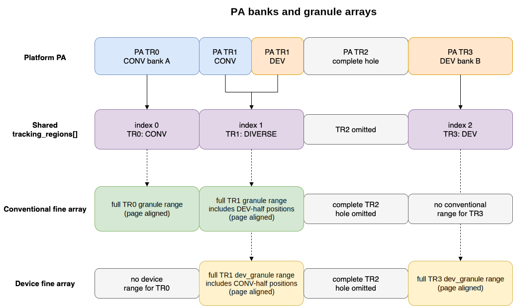
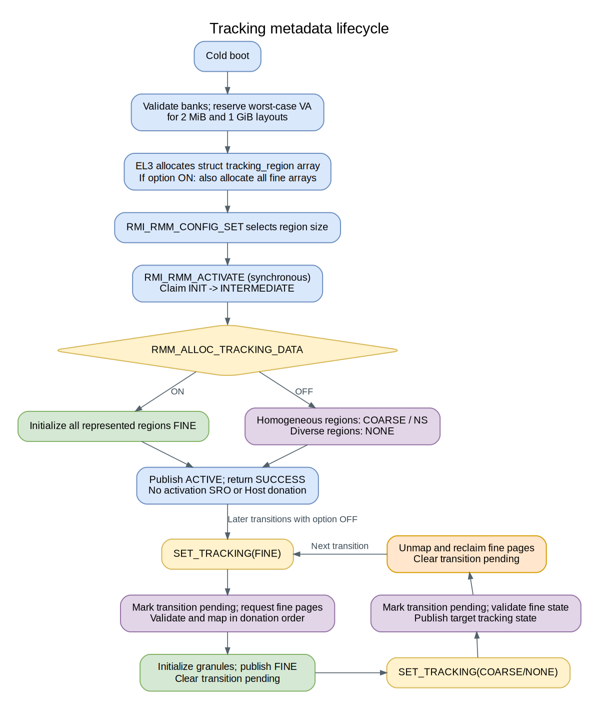
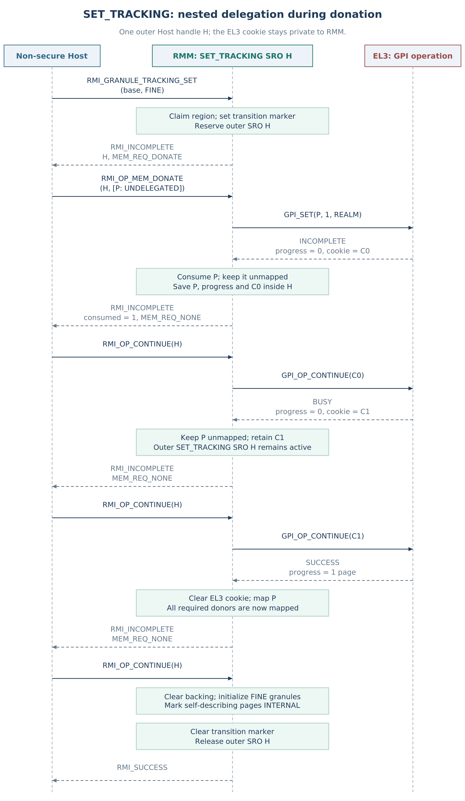
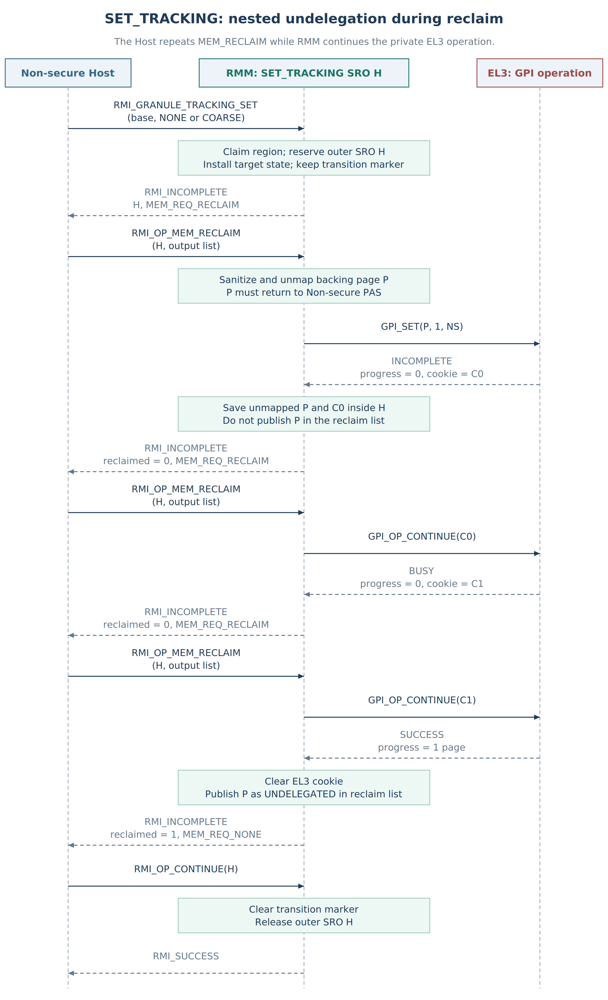
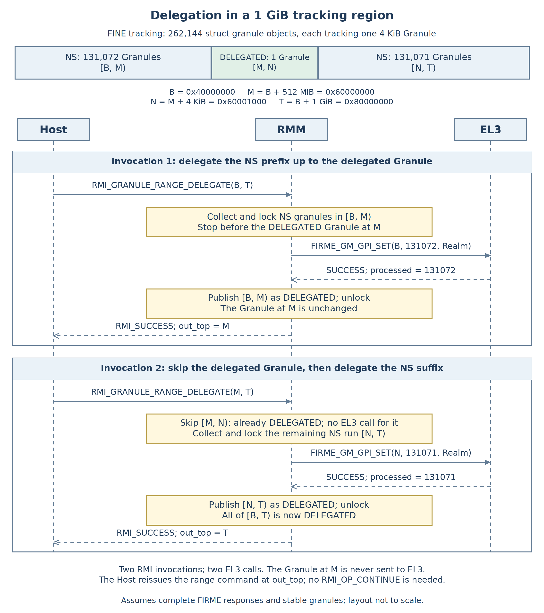
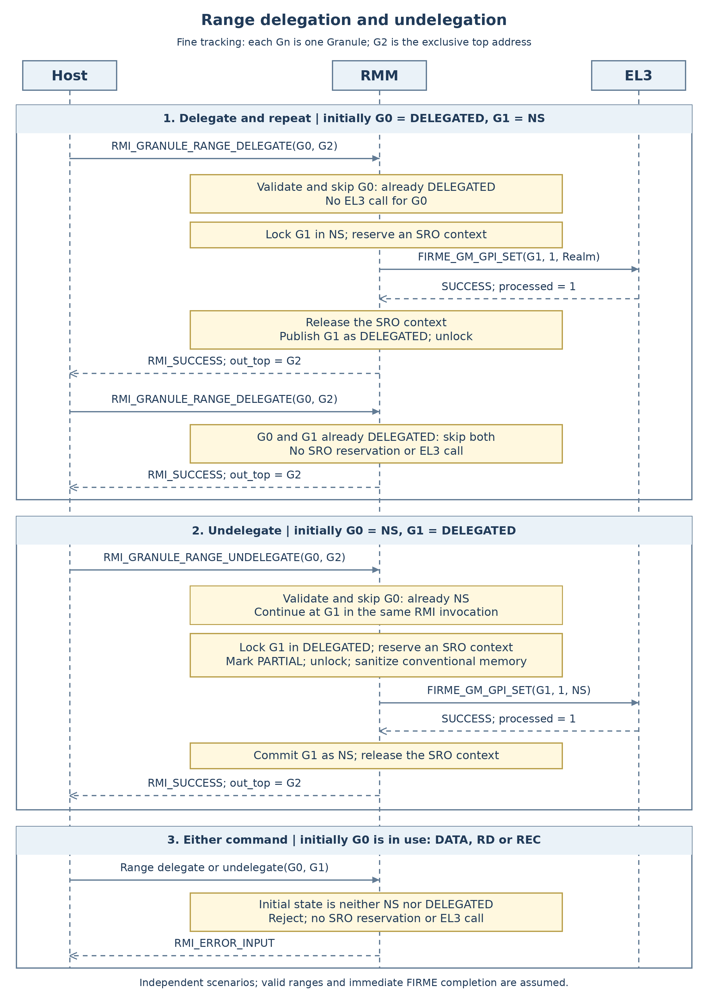
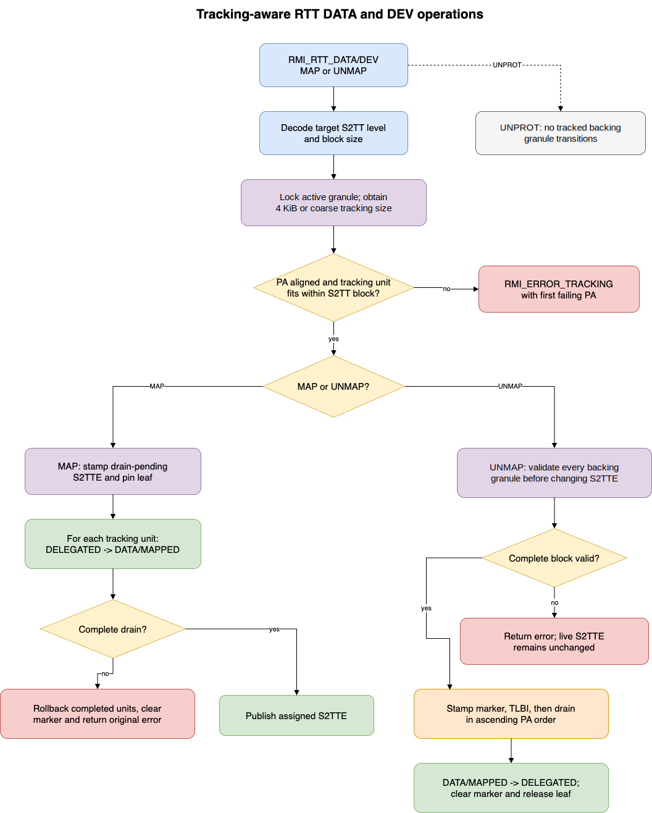

.. SPDX-License-Identifier: BSD-3-Clause
.. SPDX-FileCopyrightText: Copyright TF-RMM Contributors.

#################################
Dynamic Granule object management
#################################

|RMM| needs metadata to record how physical memory is being used. Keeping a
separate ``struct granule`` for every 4 KiB page can require a large amount
of memory. Tracking regions let |RMM| use one ``struct granule`` for a whole
region when possible, and separate granules for its pages when needed.

This guide starts with that choice, then explains where the metadata lives,
how |RMM| changes the tracking mode safely, and how range commands use it.
Most examples use a 2 MiB region containing 512 Granules of 4 KiB each.
Examples using 1 GiB regions say so explicitly.

For the wider memory design, see :doc:`memory-management`. The full lock
ordering rules are in :doc:`locking`, and the RTT range-command flows are in
:doc:`rtt-map-unmap`.

**************
Tracking model
**************

Terminology
===========

An RMI *Granule* is a 4 KiB unit of physical memory. A ``struct granule``
records the state, lock and reference count for conventional memory.
Device memory uses ``struct dev_granule``. Either object can track one
physical Granule or a whole tracking region.

The names ``struct granule`` and ``struct dev_granule`` refer to these
bookkeeping objects; *physical Granule* refers to the 4 KiB memory unit.
*Tracking size* is the amount of physical memory represented by one object,
not its size in bytes. Rules stated for granules apply to both structs unless
a memory category is specified.

A *tracking region* is a fixed-size range of physical addresses (PAs). The
Host selects 2 MiB or 1 GiB regions with ``RMI_RMM_CONFIG_SET`` before
activation. Each region starts at an address aligned to that size.
If a region contains any platform memory, |RMM| gives it a
``struct tracking_region``. This C object stores the region's tracking state,
memory category, transition marker, reader-writer lock and coarse granule.
Together, the ``struct tracking_region`` array and the fine granule arrays
form the *tracking metadata*. Each region can use either:

* one coarse granule for the complete tracking region; or
* one fine granule for each 4 KiB position in the tracking region.

For example, consider the 2 MiB region starting at ``0x80000000``:

.. code-block:: text

   Physical memory:  [ G0 ][ G1 ][ G2 ] ... [ G511 ]
                       Each Granule is 4 KiB

   COARSE tracking:  [ one struct granule covers all 512 physical Granules ]
   FINE tracking:    [ F0 ][ F1 ][ F2 ] ... [ F511 ]
                       One struct granule per physical Granule

With coarse tracking, the whole region has one state, such as ``DELEGATED``.
With fine tracking, ``G0`` can be ``DELEGATED`` while ``G1`` is ``NS``.
The physical region stays the same size when its tracking mode changes.

These are two different kinds of state: ``FINE`` and ``COARSE`` describe
*how memory is tracked*; ``NS``, ``DELEGATED`` and ``DATA`` describe
*how that memory is used*. For example, a region can be ``COARSE`` with its
single granule in ``DELEGATED`` state. See :doc:`memory-management` for
the Granule states.

Both coherent and non-coherent device memory use ``dev_granules``. Device
lookups also return the coherency type, so using the same struct type does
not lose that distinction. The ``struct tracking_region`` object records
which coarse or fine representation is active.

The tracking state has the following meaning:

.. list-table:: Tracking states
   :header-rows: 1

   * - State
     - Active representation
     - Meaning
   * - ``RESERVED``
     - None
     - The queried PA range is not covered by any platform memory bank.
   * - ``NONE``
     - None
     - A represented region currently has no usable granule structs.
   * - ``FINE``
     - Fine granule arrays
     - Each valid 4 KiB Granule has an independently managed granule.
   * - ``COARSE``
     - Granule in ``struct tracking_region``
     - One granule represents the complete tracking region.

For example, ``NONE`` can describe a region of real memory that has not yet
been given granules. ``RESERVED`` describes a hole in the platform memory
map. Allocating granules cannot turn a hole into usable memory.

A *homogeneous* region is fully covered by one memory category. A *diverse*
region contains a hole or more than one category; the implementation calls
this composition ``mc_diverse``. That name is internal, not an RMI category.
For example, a region with 1 MiB of conventional memory and 1 MiB of device
memory is diverse. It cannot use one coarse granule for both halves.
It must use ``FINE`` tracking or remain ``NONE``.

Tracking metadata layout
========================

The platform describes its memory as banks: address ranges with a memory
category. It supplies separate ``struct plat_memory_bank`` arrays for
conventional, coherent-device and non-coherent-device memory. |RMM| copies
these into ``struct tracking_memory_bank`` arrays, combining the device banks
and retaining each bank's category. It sorts the arrays by PA and checks that
their ranges do not overlap.

Each ``struct tracking_memory_bank`` stores the bank's PA range, memory
category and starting indices in the ``struct tracking_region`` and fine
granule arrays. The term *memory bank* refers to the physical address range
described by the structure.

``tracking_regions[]`` contains one ``struct tracking_region`` for each region
that contains any memory, in PA order. Whole regions with no memory take no
array space. Two banks within the same region share one
``struct tracking_region``.

For example, this layout needs only two entries:

.. code-block:: text

   2 MiB physical regions              tracking_regions[]

   0x80000000  [ conventional bank A ]  -> [0]
   0x80200000  [        hole         ]     no entry
   0x80400000  [ bank B  |  bank C   ]  -> [1] shared by B and C
   0x80600000  end

   Bank B: conventional, 0x80400000 to 0x80500000
   Bank C: device,       0x80500000 to 0x80600000

Fine granules live in two separate arrays:

* ``granule_array_tr`` contains fine ``granules`` for conventional memory; and
* ``dev_granule_array_tr`` contains fine ``dev_granules`` for both device
  categories.

These arrays also omit whole-region holes. Within a represented region,
however, each applicable array reserves a slot for every 4 KiB position.
In the example, region ``[1]`` has 512 conventional slots and 512 device
slots. Only the conventional slots for bank B and the device slots for bank C
correspond to valid memory. This leaves a simple calculation from a PA to
its slot, even when banks share a region.

Each region's fine-granule storage starts and ends on a page boundary,
with padding where needed. A metadata page therefore belongs to just one
region, so |RMM| can reclaim it without removing another region's granules.
Reserving these array positions does not itself allocate physical memory;
the allocation modes mentioned later below determine when pages are supplied.

   Platform PA banks map into a shared ``struct tracking_region`` array and
   separate fine ``granule`` and ``dev_granule`` arrays.

To find a granule from a PA, |RMM| first binary-searches the appropriate
``struct tracking_memory_bank`` array. The matching structure's
``tracking_start_idx`` and ``granule_start_idx`` identify its starting entries
in ``tracking_regions[]`` and the fine granule array. |RMM| then calculates
the region and Granule offsets.
The reverse lookup checks that an array slot belongs to real memory in a
bank. Slots for holes or padding have no valid PA.

``struct tracking_region``
==========================

``struct tracking_region`` contains:

* a union holding either a coarse ``granule`` or a coarse ``dev_granule``;
* a reader-writer lock protecting the choice of coarse or fine tracking; and
* a compact field containing the tracking state, memory composition and a bit
  indicating that a tracking change is in progress.

Only the selected representation is active. For example, when changing from
coarse to fine, |RMM| prepares the fine granules while holding the region's
write lock. It then publishes ``FINE``, making those granules active.
The old coarse granule becomes inactive. Runtime callers must always use
the active representation; the locking protocol is explained below.

*************************
Initialization and memory
*************************

Boot-time setup
===============

Early in cold boot, ``glob_data_init()`` allocates 8 KiB for one
``struct tracking_region_data`` through ``rmm_el3_ifc_reserve_memory()``.
This API normally requests memory from EL3 using ``SMC_RMM_RESERVE_MEMORY``;
with ``RMM_EL3_COMPAT_RESERVE_MEM``, it uses the platform reservation callback.
The allocation is mapped into |RMM|, and its PA, VA and size are recorded in
``struct glob_data``.

The first 4 KiB contains the embedded ``struct tracking_memory_bank`` arrays:
64 conventional-memory entries and 64 device-memory entries, populated from
the platform banks. The second 4 KiB contains the configured region size,
counts, initialization flag, a pointer to the ``struct tracking_region`` array,
and three array-mapping records containing VA, size and mapping state. The
remaining space is alignment padding. The ``struct tracking_region`` and fine
granule arrays have separate backing allocations.

``struct tracking_region_data`` survives Live Firmware Activation (LFA),
which replaces the running firmware image.

Before the Host selects a region size, |RMM| calculates how much array space
each supported size needs. It reserves virtual address (VA) ranges in its low
VA space, large enough for either layout, for:

* the ``struct tracking_region`` array, ``tracking_regions[]``;
* the fine ``granule`` array; and
* the fine ``dev_granule`` array.

Configuration calculates the indices in each ``struct tracking_memory_bank``
for the chosen size within those fixed reservations. During LFA,
``glob_data_init()`` checks the ``version`` field in ``struct glob_data``,
and the new image reuses the existing indices, mappings and granule state.

Activation modes
================

The permanent ``struct tracking_region`` array, ``tracking_regions[]``, always
uses EL3-private memory, allocated during cold boot for the largest supported
layout and retained across LFA. This memory is reserved outside Host-managed
memory; it needs no ``struct granule`` of its own. Activation therefore cannot
introduce a recursive need for fine metadata to describe Host-donated backing
for ``struct tracking_region``.

``RMM_ALLOC_TRACKING_DATA`` selects how the fine granule arrays are backed:

.. list-table:: Tracking metadata allocation modes
   :header-rows: 1

   * - Configuration
     - How metadata memory is supplied
     - Initial tracking state
     - Later transitions
   * - Enabled
     - EL3 supplies all reserved array storage at boot. Activation initializes
       the selected layout.
     - Every represented region finishes activation as ``FINE``.
     - No metadata donation or reclaim is needed.
   * - Disabled
     - EL3 supplies the ``struct tracking_region`` array at boot. Fine backing is
       donated later by the Host.
     - Homogeneous regions start ``COARSE``; diverse regions start ``NONE``.
     - ``RMI_GRANULE_TRACKING_SET`` donates fine pages on entry to ``FINE``
       and reclaims them on exit from ``FINE``.

With the option enabled, all metadata memory must be available at boot;
failure to allocate it is a boot failure. Either supported region size can
then be selected without further allocation.

With the option disabled, only the permanent ``struct tracking_region`` array
must be available at boot; failure to allocate it is a boot failure. The Host
supplies pages backing the fine granule arrays as regions need them. For
example, an unused homogeneous region can start ``COARSE``.
When the Host needs to manage one of its 512 pages separately, it requests
``FINE`` tracking and supplies metadata memory. If the region later meets
the conditions for ``COARSE`` again, the Host can reclaim that memory.

SRO donation and reclaim
========================

A *Stateful RMI Operation* (SRO) lets one operation span several Host calls.
|RMM| saves its progress and returns a handle. The Host uses that handle to
continue the operation, donate requested memory or reclaim returned memory,
as directed by the response. Here, *donation* means supplying pages for |RMM|
to use as metadata; *reclaim* means getting those pages back.

Activation completes synchronously in both allocation modes:

#. Atomically change the global RMM state from ``INIT`` to ``INTERMEDIATE``.
   Configuration changes and a second activation are rejected during setup.
#. Initialize ``tracking_regions[]`` using its existing EL3-private backing.
   With preallocated fine arrays, every region starts ``FINE``. Otherwise,
   homogeneous regions start ``COARSE`` and diverse regions start ``NONE``.
#. Publish the global state ``ACTIVE`` and return ``RMI_SUCCESS``.

Activation does not reserve an SRO or request Host memory. The temporary global
``INTERMEDIATE`` state serializes initialization; it is separate from the
unimplemented tracking state of the same name.

For a later change from ``COARSE`` to ``FINE``, the sequence is:

#. Validate the source region and mark the tracking change as pending.
#. Request pages for its conventional and/or device fine arrays, depending
   on which memory types the region contains.
#. Validate and map the donated pages at the reserved VAs, in donation order.
#. Initialize the fine granules and publish ``FINE`` before finishing the
   SRO and clearing the pending marker.

When leaving ``FINE``, the order is reversed in one important respect:
|RMM| first switches to ``COARSE`` or ``NONE``, then unmaps and returns the
now-unused fine metadata. The marker remains set until reclaim finishes.
In this allocation mode, entering or leaving ``FINE`` always transfers at
least one page; a completed transition leaves no unused fine backing behind.

Where donated pages come from
-----------------------------

Usually, a metadata page comes from another region and already has a fine
granule. It must be delegated conventional memory. Its granule changes
from ``DELEGATED`` to ``INTERNAL`` while |RMM| uses the page, and back to
``DELEGATED`` on reclaim.

A page donated from the target region is *self-describing*: it helps store
the fine metadata for the region that contains it. Its own fine granule
is only available after the new metadata is installed. This requires a
special rule for its donation state:

.. list-table:: Donating a conventional page from the target region
   :header-rows: 1

   * - Current representation
     - Required donation state
     - How |RMM| accepts the page
   * - ``NONE``
     - ``UNDELEGATED``
     - Ask EL3 to move the page into Realm Physical Address Space (PAS).
   * - ``COARSE`` with state ``NS``
     - ``UNDELEGATED``
     - Ask EL3 to move the page into Realm PAS.
   * - ``COARSE`` with state ``DELEGATED``
     - ``DELEGATED``
     - The page is already in Realm PAS.

For example, suppose region A is ``COARSE`` and ``NS``. The Host donates
page ``P`` from A to help create A's fine granules. |RMM| first delegates
``P`` through EL3. Once all metadata is installed, ordinary pages have fine
granules in ``NS`` state, while ``P`` has a granule in ``INTERNAL``
state because |RMM| is using it.

On rollback or reclaim, the remaining representation determines how to
return a self-describing page. An ``NS`` or untracked page is undelegated
through EL3 and returned as ``UNDELEGATED``. A page covered by a delegated
coarse granule stays ``DELEGATED``. This exception applies only to pages
in the target region; it does not allow an untracked page elsewhere to be
donated as ordinary metadata.

A metadata page's PA does not determine the lock order of the granules
stored in it. The order follows the represented memory's PA, regardless of
where the Host placed the metadata.

   Tracking metadata lifecycle for EL3 allocation and Host SRO donation.

.. _set-tracking-nested-sro:

SET_TRACKING with a nested EL3 operation
----------------------------------------

Moving a metadata page between Non-secure and Realm PAS can itself take
several EL3 calls. There are then two operations to keep track of:

* The outer ``RMI_GRANULE_TRACKING_SET`` operation, called SET_TRACKING below,
  owns the region and metadata transfer. The Host knows it by handle ``H``.
* The inner EL3 operation changes a page's PAS. |RMM| knows it by a private
  continuation cookie ``C`` returned by EL3.

For example, EL3 may finish delegating page ``P`` while SET_TRACKING still
needs to initialize the fine granules. Cookie ``C`` is then finished,
but handle ``H`` remains live until the outer operation also finishes.
The Host always uses ``H``; it never sees or submits ``C``.

Both operations' progress is saved in the same RMM SRO context, in
``sro_tracking_ctx``. No second SRO handle is needed, and SET_TRACKING does
not call the RMI range-delegation or range-undelegation handlers.
It cannot be cancelled. Its pending marker excludes other region users until
it finishes, but Granule locks are released before each return to the Host.

The shared helper ``rmm_el3_ifc_gtsi_step()`` manages the EL3 progress. It is
also used by range delegation, undelegation and delegation rollback. A valid
cookie means resume with ``GPI_OP_CONTINUE``; otherwise the helper starts a
``GPI_SET`` for the remaining range. Each invocation issues at most one
request through the FIRME interface to EL3. The caller still handles memory
sanitization, tracking-state updates and progress reports to the Host.

         EL3 cookie, with BUSY, continuation, mapping and final FINE publication

   Donation into ``FINE`` tracking. ``P`` is the last required self-describing
   page and starts as ``UNDELEGATED`` in a ``NONE`` or NS ``COARSE`` region.
   All RMM-to-EL3 arrows use the shared GPI helper. ``C1`` denotes the cookie
   returned with BUSY; it may equal ``C0``.

In the donation example:

#. EL3 returns ``INCOMPLETE`` for ``P``. |RMM| accepts ``P`` from the donation
   list but leaves it unmapped until its PAS change finishes. The Host must
   not donate it again; any later pages in that list remain with the Host.
#. The Host calls ``RMI_OP_CONTINUE(H)``. |RMM| uses ``C`` to resume EL3's
   work. More than one continuation may be needed.
#. Once EL3 finishes, |RMM| maps ``P``. It asks for any remaining donors or,
   as shown, a final continuation to initialize the fine representation.
#. That final continuation publishes ``FINE``, clears the pending marker
   and releases ``H``.

         successive memory reclaim calls resume the private EL3 operation

   Reclaim after leaving ``FINE`` for ``NONE`` or NS ``COARSE``. ``P`` is the
   last self-describing backing page and must return to Non-secure PAS.
   Previously completed pages may already have been returned to the Host.
   All RMM-to-EL3 arrows use the shared GPI helper.

During reclaim, the Host follows ``MEM_REQ_RECLAIM`` and repeats
``RMI_OP_MEM_RECLAIM(H, ...)``. Internally, |RMM| may use those calls to
resume EL3 with ``GPI_OP_CONTINUE(C)``. A page awaiting EL3 completion stays
unmapped and out of the reclaim list. Pages already returned remain complete.
Once every page has been returned, ``MEM_REQ_NONE`` tells the Host to make
the final ``RMI_OP_CONTINUE(H)``. That clears the marker and releases the SRO.

For the shared EL3 cookie and continuation rules, see
:ref:`delegation-progress-policy`. SET_TRACKING handles page ownership and
cleanup as follows:

* Initial donor delegation returning ``BUSY`` makes no
  progress and retains no cookie. The donor remains unconsumed with the Host,
  which may resubmit it through ``RMI_OP_MEM_DONATE``.
* Reclaim returning ``BUSY`` without a retained EL3 operation leaves the page
  in Realm PAS. |RMM| restores its mapping and withholds it from the reclaim
  list until a retry succeeds.
* Donation encountering ``OP_CONFLICT`` discards the EL3 cookie and starts
  reclaim of all accepted donors. An unaccepted donor remains with the Host;
  an accepted donor that has not been delegated is returned untouched, without
  mapping or sanitization. Earlier delegated donors are reclaimed through the
  normal cleanup path. The transition marker remains set until cleanup finishes.
  The final ``RMI_OP_CONTINUE`` clears the marker, releases ``H`` and returns
  ``RMI_BLOCKED``. If no donor was accepted, there is no reclaim step.
* Permanent delegation failure after accepting a donor returns that donor
  untouched in Non-secure PAS, without mapping or sanitizing it. |RMM| also
  reclaims earlier accepted backing and keeps the transition marker until all
  accepted pages have been returned through ``RMI_OP_MEM_RECLAIM``. A final
  ``RMI_OP_CONTINUE`` returns ``RMI_ERROR_INPUT`` and releases ``H``.

Tracking transitions
====================

Changing the tracking mode must preserve the state of the memory it
describes. Splitting one granule into many is possible for more states
than merging many granules into one.

For example, with metadata supplied from outside a homogeneous 2 MiB region:

* Splitting a coarse ``DELEGATED`` granule creates 512 fine
  ``DELEGATED`` granules.
* Merging 512 fine ``DELEGATED`` granules creates one coarse
  ``DELEGATED`` granule.
* Merging 511 ``DELEGATED`` granules and one ``NS`` granule is rejected:
  a single granule cannot record both states.
* Even 512 ``DATA`` granules cannot currently be merged. The implementation
  only allows fine-to-coarse conversion for ``NS`` or ``DELEGATED`` memory.

The full rules are below. An *ordinary granule* means one that does not
describe a self-describing metadata page. Those metadata pages are locked
in ``INTERNAL`` state and handled separately during reclaim. At least one
ordinary granule must exist when leaving ``FINE``. Every transition to
``COARSE`` also requires a homogeneous region.

.. list-table:: Supported representation transitions
   :header-rows: 1

   * - Transition
     - Required Granule state
     - Metadata action in SRO mode
   * - ``NONE`` to ``FINE``
     - New granules are initialized as ``NS``.
     - Donate the target region's fine pages.
   * - ``NONE`` to ``COARSE``
     - The new coarse granule is initialized as ``NS``.
     - None; the region must be homogeneous.
   * - ``FINE`` to ``COARSE``
     - Every ordinary granule must have the same ``NS`` or ``DELEGATED``
       state.
     - Reclaim the fine pages after publishing ``COARSE``.
   * - ``FINE`` to ``NONE``
     - Every ordinary granule must be ``NS``.
     - Reclaim the fine pages after publishing ``NONE``.
   * - ``COARSE`` to ``FINE``
     - Conventional: ``NS``, ``DELEGATED`` or ``DATA``. Device: ``NS``,
       ``DELEGATED`` or ``MAPPED``.
     - Donate the target region's fine pages.
   * - ``COARSE`` to ``NONE``
     - The coarse granule must be ``NS``.
     - None.

Splitting coarse ``DATA`` or ``MAPPED`` copies its reference count to each
fine granule. For example, if the coarse count is 2, every new fine count
is also 2: each page still has the same auxiliary mapping references. The
count is not divided among the pages. Objects such as ``RD`` and ``RTT``
always need fine tracking and cannot use this split path.

Requesting the state already installed succeeds without changing anything,
unless a tracking SRO owns the region. ``INTERMEDIATE`` tracking is not
currently supported.

******************
Runtime management
******************

Lookup and locking
==================

Two locks protect different things:

* The region's reader-writer lock protects the choice of active granules.
* A Granule lock protects a selected granule's state and use.

Runtime callers use tracking-aware lookup helpers to make the handover
between these locks safely. A regular lookup does the following:

#. Find the ``struct tracking_memory_bank`` and ``struct tracking_region``
   for the input PA.
#. Acquire the tracking-region read lock.
#. Verify that the active tracking state supplies the requested granularity.
#. Select the active coarse or fine granule.
#. Acquire the selected Granule lock and verify its expected state.
#. Release the tracking-region read lock.

The read lock keeps the chosen representation active until the caller has
locked its granule. The granule lock then keeps it active for as long
as the caller needs it. An unlocked granule pointer alone provides no
such protection: its metadata could be reclaimed by a later transition.

For example, suppose all fine granules are ``NS``. CPU A locks ``F7``
and releases the region read lock. CPU B then tries to make the region coarse.
B can take the region write lock, but it cannot lock ``F7``. B must release
all locks it acquired for this attempt and return ``RMI_BUSY``. A can finish
using ``F7``, and B can retry.

A transition never waits for another caller while holding the region writer:

#. Try the region write lock. If a reader is active, back off.
#. Try the active source granule locks. A coarse source needs one lock.
   A fine source locks ``granules`` first, then ``dev_granules``,
   with each group in ascending PA order. Check the allowed states as each
   lock is acquired; ordinary fine granules must all have the same state.
#. If any lock is busy, release the source locks already acquired and the
   region writer, then return ``RMI_BUSY``.
#. Otherwise, initialize the inactive destination and publish the new state.
   Release the source locks, then the region write lock.

Backing off also lets an ordinary caller perform another lookup while holding
an earlier granule lock. Multi-Granule callers must still acquire
granules in the order specified by :doc:`locking`. Each lookup manages
its own short-lived region read lock.

A tracking SRO performs the same source locking and validation before setting
its pending marker. A busy lock or invalid state leaves the marker clear.
Once set, the marker blocks new ordinary lookups during metadata transfer.
Before publishing the new state, the SRO reacquires the region write lock and
any active source-granule locks. Once all required metadata pages have been
donated, lock contention during this step preserves the donated pages and
pending marker, and returns ``RMI_INCOMPLETE`` with ``MEM_REQ_NONE``. The Host
retries through ``RMI_OP_CONTINUE``.

Following the lock order and backing off avoids deadlock. It does not
guarantee fairness: continuous reader or granule activity can keep
delaying a transition.

SRO context reservation
=======================

|RMM| has a finite pool of SRO contexts. Where possible, it validates the
request and selects the work before reserving one. For example, a request
to set an already-installed tracking state needs no context. Invalid input,
incompatible tracking and ineligible Granule states can also be rejected first.

A context must be reserved before work that might need to continue in another
RMI call. In particular, |RMM| needs somewhere to save an EL3 cookie before
issuing a request that can return ``INCOMPLETE``. On completion or failure it
releases the context. Before yielding, it saves the progress and seals the
context so the Host can resume it using the returned handle.

Single and range operations
===========================

Single-Granule RMI commands require fine tracking. If the address belongs
to a coarse, ``NONE`` or ``RESERVED`` region, the lookup cannot return such an
object and reports ``RMI_ERROR_TRACKING``.

Range commands ask for the *active tracking size*: how many bytes the selected
granule covers. That is 4 KiB for fine tracking, or the whole configured
region size for coarse tracking. The caller advances in those units and checks
that each unit:

* begins at an address aligned to the active tracking size; and
* fits completely within the remaining command range.

For example, a coarse region at ``0x80000000`` can be delegated as a whole
2 MiB unit. A request for only its first 4 KiB cannot use that granule and
fails with ``RMI_ERROR_TRACKING``. After switching the region to ``FINE``,
that 4 KiB request can use its own granule, subject to the normal state
checks.

A lookup failure caused by an unavailable or incompatible representation is
returned as encoded ``RMI_ERROR_TRACKING``. The current implementation reports
tracking error level zero and includes the first failing PA. Invalid addresses,
categories or object states instead return the command-appropriate input or
state error.

A region with a pending tracking SRO returns ``RMI_BLOCKED``, without
tracking-error level or PA fields. The Host must finish that SRO before
retrying. A busy transition lock instead returns ``RMI_BUSY`` and can be
retried. These results describe different causes:

.. list-table:: Tracking-related results
   :header-rows: 1

   * - Result
     - Example cause
     - What allows progress
   * - ``RMI_ERROR_TRACKING``
     - A 4 KiB request encounters a coarse granule covering 2 MiB.
     - Use compatible tracking and range sizes.
   * - ``RMI_BLOCKED``
     - SET_TRACKING is still waiting for metadata donation.
     - Complete the owning tracking SRO, then retry.
   * - ``RMI_BUSY``
     - A transition cannot acquire a granule lock.
     - Retry after the current lock holder can finish.

The ``RMI_BLOCKED`` behavior follows RMM v2.0 Beta 3 section B4.3.3,
rule ``RBPKWX`` for access to an object left in an intermediate state.

Skipping memory already in the target state
-------------------------------------------

Delegation skips memory that is already ``DELEGATED``. Undelegation skips
memory that is already ``NS``. The skip counts as successful progress and
needs no SRO context or EL3 call, although tracking and range checks still
apply. This follows RMM v2.0 Beta 3 section A2.3.6.2, rule ``IRZJLF``.

In-use states such as ``DATA``, ``RD`` and ``REC`` cannot be skipped. At the
initial address they cause ``RMI_ERROR_INPUT``. If the command has already
processed some memory, it returns that progress and leaves the failing
address for the Host's next invocation.

Throughout this guide, a *prefix* is the consecutive part of a range already
processed, starting at its base. The *suffix* is the part still to do.
``out_top`` is the first address after the processed prefix.

Range delegation first skips any leading ``DELEGATED`` granules, then
collects consecutive ``NS`` granules. It stops before the next
already-delegated granule, so EL3 receives only memory that needs a PAS
change. One RMI invocation issues at most one FIRME request and returns the
address after the processed prefix.

For example, consider ten fine-tracked Granules ``G1`` through ``G10``, with
``G5``, ``G6`` and ``G9`` already ``DELEGATED``. With FIRME completing each
submitted range, delegation proceeds as follows:

#. Starting at ``G1``, |RMM| collects ``G1`` through ``G4`` and stops before
   ``G5``. It asks EL3 to delegate that four-Granule range and returns ``G5`` as
   the next address.
#. The Host reinvokes the command at ``G5``. |RMM| skips ``G5`` and ``G6``,
   asks EL3 to delegate ``G7`` and ``G8``, and returns ``G9``.
#. The Host reinvokes the command at ``G9``. |RMM| skips ``G9``, asks EL3 to
   delegate ``G10``, and returns the end of the requested range.

The sequence therefore uses three RMI invocations and three EL3 delegation calls.
An EL3 partial response can require additional Host invocations because only
the processed prefix is reported as progress.

The same rule applies in a larger region. Consider a fine-tracked 1 GiB
region, fully covered by conventional memory, with just one Granule already
delegated at its midpoint:

* ``B = 0x40000000`` is the region base.
* ``M = 0x60000000`` is the midpoint, 512 MiB after ``B``.
* ``N = 0x60001000`` is one Granule after ``M``.
* ``T = 0x80000000`` is the region's exclusive top, 1 GiB after ``B``.

The notation ``[B, M)`` includes ``B`` and stops just before ``M``.
Assuming EL3 completes each request:

#. The first invocation delegates ``[B, M)`` and returns ``RMI_SUCCESS``
   with ``out_top = M``.
#. The Host calls ``RMI_GRANULE_RANGE_DELEGATE(M, T)``. |RMM| skips the
   already-delegated ``[M, N)``, delegates ``[N, T)`` and returns
   ``out_top = T``.

The skipped Granule is excluded from both EL3 requests. These are two
successful range calls; the Host starts the second at ``out_top`` rather
than using ``RMI_OP_CONTINUE``. The skip does not cause a tracking error.

         before a delegated Granule at the midpoint, then skip it and
         delegate the remaining NS suffix

   Delegation across an already-delegated 4 KiB Granule in a 1 GiB tracking
   region. FIRME completes the first request for 131,072 Granules and the
   second for 131,071 Granules. Together with the skipped Granule, these cover
   all 262,144 Granules in the region. Partial FIRME responses can require
   additional invocations. The memory layout is not drawn to scale.

With ``COARSE`` tracking, the same 1 GiB region has a single granule and
cannot represent an individual delegated Granule between ``NS`` runs. An
already-``DELEGATED`` coarse region is skipped as one complete tracking unit;
an ``NS`` coarse region is delegated as a whole. A partially completed coarse
transition remains ``PARTIAL`` until continuation or rollback resolves it, as
described below.

Undelegating a range
--------------------

Range undelegation skips leading ``NS`` granules, then processes consecutive
``DELEGATED`` granules in the current region. Fine tracking can batch many
4 KiB pages; coarse tracking processes one whole 2 MiB or 1 GiB unit.
A fine batch stops at the requested top, a memory-bank or region boundary,
or a change in state or device coherency type.

Before contacting EL3, |RMM| prepares the batch:

#. Reserve an SRO context. If this fails, unlock the granules and leave
   them ``DELEGATED``.
#. Change the locked granules to ``PARTIAL``, then release their locks.
   This state records that the SRO owns work that is not yet complete.
#. Sanitize the whole conventional-memory batch, overwriting its old contents
   before EL3 changes any page's PAS. Device memory is not sanitized. If an
   interrupt pauses this work, save the batch and next page offset for
   ``RMI_OP_CONTINUE``.

Continuation finishes sanitizing the original batch before its first EL3
request. Keeping the selected range together lets EL3 optimize range processing.

After each EL3 call, completed fine pages become ``NS``. If EL3 retains a
cookie, the SRO still owns the remaining ``PARTIAL`` pages. Once the EL3
operation ends, |RMM| returns any completed prefix as ``RMI_SUCCESS`` with
``out_top`` and restores untouched pages to ``DELEGATED`` for a new request.
Skipped leading ``NS`` pages count as progress. RMM owns the pages being
undelegated, so an EL3 conflict or rejection violates the ownership contract.
The EL3 adapter asserts this contract for initial requests and continuations,
including metadata reclaim and delegation rollback.

For example, if EL3 finishes the first 3 pages of an 8-page fine batch and
retains no cookie, those 3 stay ``NS``. The other 5 return to ``DELEGATED``,
and ``out_top`` points to page 4. A coarse granule cannot record this mix:
it becomes ``NS`` only when its entire region has reached Non-secure PAS.

With no progress, an initial fine ``BUSY`` returns ``RMI_BUSY``. An existing
SRO instead yields and retries.

         undelegation, and rejection of an in-use Granule

   Target-state handling for range delegation and undelegation. Each ``Gn`` is
   one fine-tracked conventional Granule; ``G2`` is the exclusive top address.
   The three scenarios are independent and assume valid ranges and immediate
   FIRME completion. A repeated delegation needs no EL3 call once every
   granule is ``DELEGATED``. Undelegation skips an already-``NS`` prefix
   and processes the following ``DELEGATED`` run in the same invocation. Device
   and coarse granules use the same target-state checks at their active
   tracking size.

The legacy GTSI interface processes the selected range one Granule at a time.
Each undelegation call requires a page that |RMM| owns in Realm PAS. Delegation
rollback therefore undelegates only the prefix that EL3 successfully delegated.
Metadata reclaim invokes EL3 only when a backing page must move from Realm PAS
to Non-secure PAS. A failed donor already in Non-secure PAS is returned without
an EL3 call.

RMM Granule states record software ownership and operation progress separately
from the hardware PAS. Pages can therefore be in Realm PAS while their granules
are ``PARTIAL`` or ``INTERNAL``.

.. _delegation-progress-policy:

Delegation progress and retry policy
------------------------------------

EL3 may finish only part of a delegation request. Fine granules can record
that progress page by page. A coarse granule must eventually describe one
state for the whole region, so partial completion needs more work.

Both delegation and undelegation send EL3 as much of the Host's range as the
current region, memory banks, Granule states and device coherency allow.
An invocation stays within one region; the Host starts a new request at
``out_top`` to move into the next one.

To decide what happens next, the RMI layer needs three separate facts from
the EL3 adapter:

* **Result:** did the call succeed, encounter contention or fail?
* **Progress:** how much of the requested range did this call process?
* **Continuation:** does EL3 still have an operation to resume with a cookie?

For example, an error can arrive with valid progress. The adapter preserves
both facts; the RMI layer decides whether to return the progress, retry or
roll back. The legacy GTSI fallback likewise preserves both its completed
prefix and the first rejected Granule's error. The rules below use total
progress, including previous continuations and skipped leading Granules.

An outstanding EL3 operation must be handled first:

* ``INCOMPLETE`` retains a stateful operation. |RMM| records the returned cookie
  and any new progress, then yields ``RMI_INCOMPLETE`` with an SRO handle.
* ``BUSY`` from ``FIRME_GM_GPI_OP_CONTINUE`` means EL3 could not act on that
  invocation of the existing operation. It adds zero progress; its ``UNKNOWN``
  count is ignored. |RMM| keeps the accumulated prefix, records the returned
  cookie for that operation, and yields again. The returned cookie is used even
  if it equals the previously supplied cookie.
* These rules apply to both fine and coarse tracking. Fine progress cannot
  complete the RMI SRO while EL3 still retains the outstanding operation.

Once EL3 has no operation to resume, the result is *stateless*. |RMM| may
still need its own SRO to finish the range. Its next action depends on total
progress and tracking size:

.. list-table:: Stateless delegation results
   :header-rows: 1
   :widths: 25 38 37

   * - EL3 result
     - Coarse tracking with a partial region
     - Fine tracking with a completed prefix
   * - ``SUCCESS``
     - Keep the prefix and retry the suffix until the region is complete.
     - Return ``RMI_SUCCESS`` and the address after the prefix.
   * - ``BUSY``
     - Treat as temporary contention. Keep the prefix and retry the suffix.
     - Return ``RMI_SUCCESS`` for accumulated progress. ``BUSY`` adds no progress.
   * - ``OP_CONFLICT``
     - Roll back the accumulated delegated prefix to Non-secure PAS before
       returning ``RMI_BLOCKED``. Include any progress from the conflicting call.
     - Return ``RMI_SUCCESS`` for the completed prefix. If a new request for the
       suffix encounters the conflict without progress, return ``RMI_BLOCKED``.
   * - Permanent error, such as ``DENIED`` or ``NOT_FOUND``
     - Roll back the accumulated delegated prefix to Non-secure PAS before
       returning ``RMI_ERROR_TRACKING``.
     - Return ``RMI_SUCCESS`` for the prefix. The Host retries the suffix and
       receives the appropriate error if that invocation makes no progress.

A completed coarse region returns ``RMI_SUCCESS``. With no accumulated progress,
``OP_CONFLICT`` returns ``RMI_BLOCKED`` without rollback, for both an initial
request and a continuation. Restore any owned ``PARTIAL`` granules to ``NS``
and release the SRO before returning. An initial stateless ``BUSY`` returns
``RMI_BUSY``; an existing SRO yields and retries it. A permanent failure without
progress returns ``RMI_ERROR_INPUT``. ``SUCCESS`` without progress in the
individual EL3 call violates the FIRME result contract: |RMM| logs an ``ERROR``
and calls ``panic()``, including when assertions are disabled.

Each RMI invocation issues at most one FIRME request, then yields if more
work is needed. Without an EL3 cookie, the next ``RMI_OP_CONTINUE`` starts a
fresh ``FIRME_GM_GPI_SET`` for the remaining suffix. With a cookie, it uses
``FIRME_GM_GPI_OP_CONTINUE``. A delegation ``OP_CONFLICT`` invalidates the cookie,
including on continuation. Coarse rollback therefore starts a fresh ``GPI_SET``
to return the accumulated prefix to NS. Keep the granule ``PARTIAL`` and
return ``RMI_INCOMPLETE`` while rollback runs. Save the terminal ``RMI_BLOCKED``
status across its partial progress, ``BUSY`` responses and cookie changes.

For example, start with a coarse 2 MiB region in ``NS`` state. Assume each
EL3 response below is stateless:

.. list-table:: Completing a coarse delegation across three Host calls
   :header-rows: 1

   * - Host call
     - EL3 response
     - |RMM| action
   * - Range delegation
     - ``SUCCESS`` for the first 64 KiB
     - Keep 64 KiB of progress; yield ``RMI_INCOMPLETE`` with handle ``H``.
   * - ``RMI_OP_CONTINUE(H)``
     - ``BUSY``, no new progress
     - Keep the same 64 KiB; yield again with ``H``.
   * - ``RMI_OP_CONTINUE(H)``
     - ``SUCCESS`` for the remaining 1984 KiB
     - Set the coarse granule to ``DELEGATED`` and return ``RMI_SUCCESS``.

If the last EL3 call instead reports ``DENIED`` after another 4 KiB, |RMM|
must undo all 68 KiB of delegation. Only after rollback finishes does it
return ``RMI_ERROR_TRACKING``.
If it reports ``OP_CONFLICT`` after another 4 KiB, the same 68 KiB rollback is
required, but the terminal result is ``RMI_BLOCKED``. This also applies when
the initial delegation request encounters a conflict after partial progress.

For a fine-tracked request, the first stateless 64 KiB prefix can immediately
return as ``RMI_SUCCESS``: its 16 granules can each record ``DELEGATED``.
This also holds if the response includes a conflict or permanent error. The
completed prefix is kept, and the Host can make a new request for the suffix.

``PARTIAL`` granules block SET_TRACKING with ``RMI_BLOCKED`` without starting
a tracking SRO. A fine delegation that yields before making progress reserves
its entire selected run as ``PARTIAL``. As fine pages are delegated, their states
become ``DELEGATED``; any unfinished suffix returns to ``NS`` when the SRO ends.
Granule locks are released before yielding; the SRO remains non-cancellable.

Tracking RMI commands
=====================

``RMI_GRANULE_TRACKING_GET`` queries a PA range ``[base, top)`` with
Granule-aligned endpoints. It reports the memory category and tracking state
at ``base``, and where either attribute first changes, stopping at ``top``.
It can combine adjacent banks in one result when both attributes match.
A hole reports category ``NONE`` and state ``RESERVED``.

For example, using the bank layout above, suppose bank A is coarse tracked.
A query from ``0x80000000`` to ``0x80600000`` first reports conventional,
``COARSE``, ending at ``0x80200000``. A new query starting there reports
the hole as ``NONE``, ``RESERVED``, ending at ``0x80400000``. The Host can
walk a large range by starting each query where the previous result ended.

``RMI_GRANULE_TRACKING_SET`` changes one region, identified by its aligned
base. If that base belongs to a bank, the request must give the bank's exact
RMI category. A base in a hole is accepted only when valid memory exists at a
higher physical address within the same region. That region is diverse and can
be ``NONE`` or ``FINE``; the supplied category cannot make it eligible for
``COARSE`` tracking.

SET validates the transition. Requesting the already-installed state succeeds
unless a tracking SRO still owns the region. While that SRO is donating or
reclaiming metadata, any second SET returns ``RMI_BLOCKED``, even if it asks
for the same state. The Host must finish the owning SRO first.
Invalid alignment, category, target state or source-state transition returns
``RMI_ERROR_INPUT``. ``RESERVED`` and ``INTERMEDIATE`` are not accepted as SET
targets by the current implementation.

*****************************
RTT map and unmap interaction
*****************************

Tracking size and S2TT level
============================

DATA and DEV map/unmap commands connect two views of memory. Stage 2
translation table (S2TT) entries describe Realm mappings. Tracking granules
record the state of the physical memory behind those mappings. The two views
can use different sizes, subject to this rule:

.. code-block:: text

   active tracking size <= S2TT mapping size <= tracking-region size

The S2TT walk level selects the mapping size. With the current 4 KiB Granules,
level 3 maps a 4 KiB page, level 2 a 2 MiB block and level 1 a 1 GiB block.
The size rule applies to each S2TT entry. A Host request can cover multiple
entries and tracking regions.

.. list-table:: Examples of mapping sizes and tracking sizes
   :header-rows: 1

   * - Region size
     - Tracking mode
     - Requested mapping
     - Size check
   * - 2 MiB
     - ``COARSE`` (one granule for 2 MiB)
     - 4 KiB page
     - Fails: the granule covers more than the mapping.
   * - 2 MiB
     - ``FINE`` (one granule per 4 KiB)
     - 2 MiB block
     - Passes: 512 granules cover the block.
   * - 2 MiB
     - ``FINE`` (one granule per 4 KiB)
     - 1 GiB range using 2 MiB blocks
     - Passes: each block fits within one region.
   * - 1 GiB
     - ``FINE`` (one granule per 4 KiB)
     - 1 GiB block
     - Passes: fine tracking can support a large mapping.

Passing this size check is only part of validation. The backing PA must be
aligned to the active tracking size, and each tracking unit must fit in the
unprocessed part of the block. Block alignment and the size rule keep a block
inside one region. A single S2TT block larger than the configured region returns
``RMI_ERROR_TRACKING``.

``DATA_UNMAP`` and ``DEV_UNMAP`` return their completed prefix before entering
another physical tracking region. For a 1 GiB range using 2 MiB blocks backed by
contiguous 2 MiB tracking regions, completing the first block returns
``RMI_SUCCESS`` with ``out_top`` advanced by 2 MiB. The Host reinvokes the command
at ``out_top`` to process the remaining range.

``DATA_MAP`` and ``DEV_MAP`` can complete blocks from multiple tracking regions
in one invocation. Each block completes before the next starts.

Map and unmap hold granule locks while processing memory, except that coarse
DATA_MAP owns its ``PARTIAL`` unit while zeroing and coarse unmap owns its
``PARTIAL`` unit through invalidation and drain.

A locked granule prevents a transition claim. Fine ``DATA`` and ``MAPPED``
states and coarse ``PARTIAL`` ownership also prevent claims across yields.
See :doc:`locking` for the full protocol.

Map
===

Mapping prepares the backing memory before making the translation usable.
DATA and DEV map first mark the target S2TT entry (S2TTE) as *drain pending*.
Here, a *drain* is the deferred work that brings each backing granule to
its required state. The SRO processes one active granule at a time:

* DATA locks a ``struct granule`` in ``DELEGATED`` state. With fine tracking,
  it zeroes the page under the Realm's Memory Encryption Context (MEC) and
  changes its state to ``DATA``. With coarse tracking, it claims the whole unit
  as ``PARTIAL`` and releases its lock before zeroing pages. The unit becomes
  ``DATA`` only when every page has been zeroed.
* DEV locks a ``dev_granule`` in ``DELEGATED`` state and changes its state to
  ``MAPPED``. Every tracking unit in one S2TT block must have the same device
  coherency type.

For example, mapping a fine-tracked 2 MiB conventional block processes 512 fine
``granules``. Each page is zeroed and changed from ``DELEGATED`` to ``DATA``.
Only after all 512 are ready does |RMM| publish the assigned S2TTE.

A lookup failure, size mismatch or coherency mismatch triggers rollback:
return processed granules to ``DELEGATED``, clear the
pending S2TTE marker, drop the leaf RTT reference and report the original
error. A tracking mismatch includes the failing PA in ``RMI_ERROR_TRACKING``.

Tracking stability during a map SRO
----------------------------------------

DATA_MAP and DEV_MAP retain an SRO only after making progress in the current
block. An IRQ before the first page is processed does not pause the drain.
Once a fine granule becomes ``DATA`` or ``MAPPED``, that prefix prevents
tracking transitions for the entire region, including publication of a pending
transition marker. The drain can then yield between fine granules. Rollback
has the same protection until it releases the last processed granule; it then
clears the S2TTE marker and finishes without another yield or lookup.

A valid coarse mapping covers exactly one tracking region. DATA_MAP reserves
its coarse ``struct granule`` in ``PARTIAL`` state and saves a page offset in
the SRO. Zeroing can yield on an interrupt after each page except the last;
each continuation processes at least one more page before yielding. ``PARTIAL``
prevents a tracking transition from replacing the coarse representation or
another operation from reusing the unzeroed suffix. The SRO retains ownership
without holding the granule lock. Once the whole region is zeroed, it changes
the state to ``DATA`` and finalizes the S2TTE without another yield or fallible
operation. The zeroing offset is internal progress: no fraction of the coarse
unit can be reported as a successful mapping. Errors before ownership is
claimed leave the unit unchanged; after the claim, zeroing can only yield or
complete, so it never enters fine-granule rollback.

Coarse DEV_MAP completes its single state change without yielding. An L3 page
mapping also completes after its single fine granule is processed.

A tracking transition can race with map before its first granule is locked.
If it completes first, the lookup discovers the current tracking size. If it
is still pending, the lookup returns ``RMI_BLOCKED``. Map clears its unused
S2TTE marker and drops the leaf reference without retaining an SRO. The Host
can complete the tracking operation and retry the map. If earlier blocks in
the call already completed, map returns success for that prefix instead.
Those completed blocks are not rolled back.

Across a map yield, the leaf reference keeps the RTT hierarchy and RD alive.
The fine ``DATA`` or ``MAPPED`` prefix, or coarse ``PARTIAL`` ownership, keeps
tracking stable. No granule lock or tracking-region reader is held across the
return to the Host.

Unmap
=====

Unmap checks the backing memory before making a live translation unavailable.
Every DATA ``granule`` must be ``DATA``; every DEV ``dev_granule`` must be
``MAPPED``. The size and alignment rules are the same as for map. Unmap also
checks that no auxiliary RTT references remain. Only then does it mark the
S2TTE for deferred work.

The tracking mode determines how long validation must keep a granule locked:

* With fine tracking, ``DATA`` and ``MAPPED`` states already prevent a
  tracking transition from being accepted. Unmap can release each granule
  lock after checking it.
* With coarse tracking, those states still allow a split to fine. Validation
  retains the lock until the block is queued and its S2TTE is marked pending.
  Unmap then changes the coarse ``struct granule`` or ``struct dev_granule``
  to ``PARTIAL`` and releases its lock. The SRO owns the whole unit through
  invalidation and drain. A split attempt returns ``RMI_BLOCKED`` without
  setting a tracking marker. Continuation uses the owned object directly.

For example, a coarse 2 MiB DATA block uses one ``struct granule``. The SRO
keeps it ``PARTIAL`` while completing invalidation, including an outstanding
SMMU CMD_SYNC. After invalidation, cache maintenance processes its 512 pages
with IRQ checks between pages. Each drain continuation processes at least
one page, and saves its position if it yields. The whole unit remains
``PARTIAL``, including the maintained prefix. After the last page it becomes
``DELEGATED`` and the pending S2TTE marker is cleared without another yield.

DATA_UNMAP and DEV_UNMAP queue only one coarse block before draining. Neither
holds one backing-granule lock while acquiring another, and neither retains
an outer tracking-region read lock.

After scanning the selected mappings and performing the required TLB
invalidations, unmap processes the output PAs in ascending order. DATA performs
the required cache maintenance and returns granules to ``DELEGATED``;
DEV changes fine ``MAPPED`` granules or its coarse ``PARTIAL`` unit to
``DELEGATED``. Fine drains advance one granule at a time. Coarse DATA saves
page-level cache-maintenance progress but publishes only the whole region.
Once invalidation completes, the SRO records its completion. Subsequent
continuations resume the remaining drain work without repeating the
invalidation phase.

UNPROT mappings do not own tracked backing Granules. Their map and unmap flows
therefore do not change ``granule`` or ``dev_granule`` states.

   Tracking validation and state changes around DATA and DEV RTT operations.

For the common range command, drain-marker, yield and result-formatting design,
see :doc:`rtt-map-unmap`.

*****************************
Current implementation limits
*****************************

* Only 4 KiB RMI Granules are supported.
* ``INTERMEDIATE`` tracking is not implemented.
