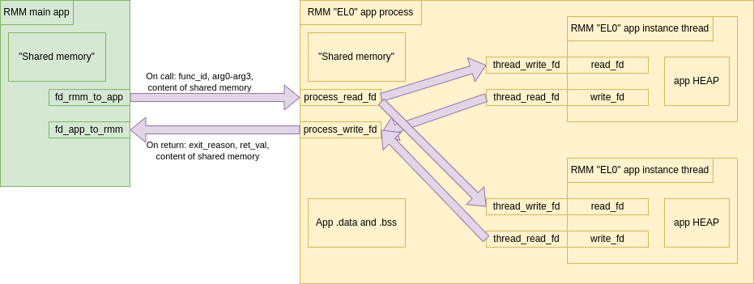

.. SPDX-License-Identifier: BSD-3-Clause
.. SPDX-FileCopyrightText: Copyright TF-RMM Contributors.

###############
EL0 apps in RMM
###############

****
Goal
****

The goal of introducing EL0 app support in TF-RMM is to improve security by
minimizing the amount of code running in privileged mode. This is achieved by
deprivileging parts of RMM to run at EL0 using the Virtualization Host
Extensions (VHE). This approach is especially desirable for code pulled in from
external projects (like Mbed TLS), as such components are often complex and
sensitive. RMM apps now run at EL0 using the EL2&0 translation regime, with the
CPU configured such that an eret instruction in EL2 transitions directly to EL0,
and the target EL of an SVC instruction is EL2. Additionally, each EL0 app has
its own isolated address space, which not only improves fault isolation but also
helps mitigate speculation-based side channels, allowing secrets within apps to
be better protected from speculative execution. This isolation mechanism also
lays the groundwork for future side-channel mitigations and facilitates their
deployment. Overall, this scheme is especially useful for sand-boxing complex
and sensitive code at EL0 and increasing the robustness of RMM.

|RMM app EL0|

This design document covers the various aspects of the implementation of the EL0
app support in RMM.

*********************
Building app binaries
*********************

The RMM app's code is in the ``app`` directory, and they may link to
libraries from the ``lib`` directory. RMM apps use a common linker script that
contains a few predefined section. The RMM app cmake file first compiles and
links the RMM app elf binary. Then the python script ``app/gen_app_bin.py``
is called that extracts the section contents along with address and size
information. Then this information is used to generate a bin file. The bin file
is a concatenation of the following:

+----------------+-------------------------------------+
| 1 page size of | 8 bytes padding (explained later)   |
| header         +-------------------------------------+
|                | magic                               |
|                +-------------------------------------+
|                | header version                      |
|                +-------------------------------------+
|                | app_name                            |
|                +-------------------------------------+
|                | app id                              |
|                +-------------------------------------+
|                | app_len                             |
|                +-------------------------------------+
|                | section 1 offset                    |
|                +-------------------------------------+
|                | section 1 size                      |
|                +-------------------------------------+
|                | ...                                 |
|                +-------------------------------------+
|                | section n offset                    |
|                +-------------------------------------+
|                | section n size                      |
|                +-------------------------------------+
|                | magic                               |
|                +-------------------------------------+
|                | Padding                             |
+----------------+-------------------------------------+
| content of section 1                                 |
+------------------------------------------------------+
| ...                                                  |
+------------------------------------------------------+
| content of section n                                 |
+------------------------------------------------------+

The number and order of sections in an RMM app elf/binary is hardcoded in the
linker script, the python script that does the extraction of section content,
and in the header definition.

The RMM app bin size is padded to be a multiple of page size.

************************
Building final RMM image
************************

The RMM core code is built and linked using its own linker script. Then objcopy
is called on the resulting elf to extract the sections to an img file. Then the
bin files for the RMM apps are built as described above. The final RMM image
is created concatenating the following elements by the python script
``app/bundle_app_rmm.py``:

* The first RMM app bin. The first 8 byte padding of the header is updated to a
  ``BL`` (branch with link) instruction, followed by 4 bytes of padding. This
  allows the offset of the first meaningful field - the section offsets in the
  app header - to remain consistent with its position in the original app
  binary. The ``BL`` instruction branches to the start of the text section in
  the RMM core img. The ``BL`` instruction uses ``PC`` relative offset to encode
  the branch target, so the instruction can be calculated when the bundled image
  is assembled. The return value that is saved in the Link Register by the
  ``BL`` instruction is used by RMM core to determine the memory address of the
  header of the first app in the bundle.
* The rest of the RMM app bins (if any) unmodified.
* The RMM core img file aligned to 64KB offset to meet ELF loader requirements.

The packaged RMM binary must be loaded at a 64KB-aligned physical address to
ensure that the RMM core itself is also 64KB-aligned. This alignment requirement
stems from the use of a 1:1 virtual-to-physical address mapping for the RMM
core. In contrast, EL0 apps run at virtual addresses determined at compile time,
which are already 64KB-aligned. As a result, the physical address alignment of
app binaries is not significant.

The number of RMM apps expected by RMM core is hardcoded in RMM core.
The RMM app headers are parsed by the RMM core during the coldboot phase. The
RMM app headers contain a magic value, so if less than the expected number of
RMM apps is added to the final bin that can be detected, then boot fails in that
case. If more than the hardcoded number of RMM apps is present, RMM boot fails
as well.

|RMM bin generation|

****************
RMM App Instance
****************

In this document app instance refers to an execution context, along with the
necessary memory that is allocated for it. In operating system terms, a thread
is analogous to an EL0 App instance.

To manage and run an RMM app instance, RMM core needs memory for the following
purposes:

1. RMM app context: A single page of memory for use by the context switch logic
   to back up registers. This memory page acts as app's CPU context storage when
   it is not scheduled. This page is mapped in the APP VA space as well, with
   permissions that it is only accessible by privileged execution (i.e. EL2).
   The mapping is necessary because, on exit from an RMM app to the RMM core,
   the RMM app's virtual address (VA) space is still active and set up in the
   High VA region, while the RMM core's VA space is not yet available. To switch
   back to RMM Core High VA space, the general purpose registers need to be
   backed up beforehand. To enable this, the app context page is mapped at the
   beginning of the app's VA space (without UNPRIV access). This fixed mapping
   allows the context switch code to use a hardcoded address for the register
   backup. Consequently, the EL0 app's accessible address space begins at a 4KB
   offset from the start of the High VA region

2. A memory page that is used to exchange RMM app specific data between the
   RMM app and the RMM app caller mapped both in EL2 and in EL0. (Also
   referenced as shared page by this document.)

3. Metadata for the RMM app (``struct app_data_cfg``). This includes

   * xlat library structures including the pointer to the pagetable for the RMM
     app.
   * entry point
   * PA of the app_reg_ctx
   * PA of the shared page

4. Page containing the pagetable for the EL0 memory mappings (currently the RMM
   app has a limited 2MB VA space)

5. Stack for RMM app.

6. Heap for RMM app.

In the current implementation there are 3 possible locations where the above
mentioned data is stored:

a. In statically allocated per-cpu buffers.
b. In the rec structure for a REC and in the rec aux pages
c. In the pdev structure for a PDEV object in the pdev aux pages

In case of *b.* and *c.* the memory pages are delegated by the host.

Note that this introduces a limitation on the stack/heap of the RMM apps, as the
max count of aux pages is limited, and RMM core is already using some of them.

****************
RMM App VA space
****************

The RMM app va space (as it is configured in the xlat library) contains the
following regions:

 * Single page for the RMM app context (Transient)
 * RMM app text
 * RMM app RO data
 * RMM app data
 * RMM app BSS
 * RMM app Shared (Transient)
 * RMM app heap (Transient)
 * RMM app stack (Transient)

The pages that are mapped in the transient region are private to the RMM app
instance. As all the other regions are common, it is possible to initialise the
xlat_ctx_cfg used by apps during RMM boot.

**************************
Initialising RMM app pages
**************************

The pages that are instance specific (`RMM App Instance`_) needs to be initialised
on creating an RMM app instance.

As it is possible that the pages are delegated by the host, and the pages need
to be mapped dynamically using slot-buffer framework, a new slot is added to the
slot buffer. When initialising such pages, the page under initialisation is
mapped into this new slot, and unmapped after initialising.

The ``app_new_instance`` function receives an array of physical addresses of
the pages to be used for the RMM app. In case of initialisation the code checks
whether the PA is in the range of the RMM core's rw PA range. If so, it can
write to it directly. If not, the slot buffer mechanism is used as described
above.

Mappings when using AUX pages for RMM app RW memory:

|RMM app memory aux|

Mappings when using statically allocated pages for RMM app RW memory:

|RMM app memory static|

*********************
RMM App Service Calls
*********************

Since the apps are running at EL0, it cannot perform some privileged operations
like communicate with EL3 or copy data from NS host buffer etc. RMM provides
some services for RMM apps (like printing). The services are required to have
the signature

    .. code-block:: bash

      typedef uint64_t (*app_service_func)(struct app_data_cfg *app_data,
                                           unsigned long arg0,
                                           unsigned long arg1,
                                           unsigned long arg2,
                                           unsigned long arg3);

Services are expected to be thread safe.

Some services can call other apps to perform its functionality (like PRNG). But
this kind of nesting is limited to one other app to avoid interdependencies
between apps.

Services are stored in a function pointer array. There is a single array in the
system.

The RMM app that calls a service must do an SVC with a predefined immediate
value. The index of the service to be executed is selected by the value of the
X0 register.

The el0_app framework calls app_enter in a loop. It exits the loop
if the SVC immediate value reports function return or yield (in future).

********************
Debugging RMM on FVP
********************

The RMM core text section offset is changed due to the app binaries being
prepended before the RMM core img. The ``bundle_app_rmm.py`` script prints the
text section offset in the binary which should be added to the RMM load address
when loading the elf in the debugger for symbols. The script output is in the
file ``<build_dir>/<build_type>/bundle_app_out.txt``. The offset is also printed
out during the build process.

The RMM apps are linked to the VA address that they are going to be loaded by
RMM core, so the RMM app symbols needs to be loaded in the debugger with offset
``0x0``

*******************
RMM Fake Host Build
*******************

In case of the fake host build, the applications are compiled as a standalone
elf file. The RMM core is compiled to the elf file ``rmm_core.elf``. RMM core
expects the app ELF files to reside in the same directory as the RMM core
executable. The first time the main RMM process calls ``app_new_instance`` the
process is forked, the image of the requested RMM app is loaded in the new
process, and a named-pipe connection isestablished between the two processes.
When the RMM app process is created, for each ``app_new_instance`` (including the
first call) a new thread is created. The main thread in the RMM app process is
responsible for dispatching the RMM app calls and returns between the main RMM
process and the RMM app thread.

There is no shared memory between the main and the RMM app processes, memory
sharing is emulated by sending over the content of the main process's "shared
page" to the RMM app thread on an ``app_run`` call, and sending back the content
of the RMM app thread's "shared page" on RMM app function return.

|RMM app host|

The help of the main process:

    .. code-block::

      $ rmm_core.elf --help
      Run RMM on the host

      Usage: rmm_core.elf [-h|--help]

      Arguments:
        -h, --help      print this message and exit.

An example call:

    .. code-block:: bash

      $ Debug/rmm_core.elf

*************************
RMM Apps currently in RMM
*************************

Currently there are 2 RMM apps in RMM:

 - attestation: Used for doing attestation related tasks, like attestation
   token generation and hash calculation
 - random: A small application with a pseudo random number generator, either
   seeded with a true random sequence, or with input from an already initialised
   random RMM app.

Currently both apps have their own build of Mbed TLS linked to them.

There is an instance of random number RMM app initialised for each of the CPUs.
There is also an attestation app initialised for each CPU for doing RIM
extension, and there is an RMM app instance initialised for each REC, to do
measurement extend and attestation token generation.

The attestation RMM app uses the random RMM app via a service. The attestation
RMM app reaches the EL3 interface (for requesting realm attestation key
and platform token) via an RMM app service.

The layout of the RMM apps can be seen on the image below:

|RMM app layout|

Note: To be continued with DA related RMM apps

************************
Directory layout of apps
************************

    .. code-block:: bash

        .
        └── app
            ├── attestation
            │   ├── el0_app
            │   │   ├── mbedtls_attest # Library                                       (EL0)
            │   │   ├── qcbor  # Library                                               (EL0)
            │   │   ├── src    # Implementation of the attestation RMM app             (EL0)
            │   │   └── t_cose # Library                                               (EL0)
            │   └── rmm_stub   # Helper function for using the Attestation RMM app     (EL2)
            ├── common
            │   ├── el0_app    # Common code that is used by multiple apps             (EL0)
            │   ├── framework  # Framework for calling an app and provide app services (EL2)
            │   ├── include
            │   └── rmm_svc    # Implementation of RMM services provided to apps       (EL2)
            └── random
                ├── el0_app
                │   ├── mbedtls_random # Library                                       (EL0)
                │   └── src    # Implementation of the Random RMM app                  (EL0)
                └── rmm_stub   # Helper function for using the Random RMM app          (EL2)

**********************************************
Proposed Enhancements to the RMM App Framework
**********************************************

#. Shared Memory for ``fake_host``

   Implement support for shared memory to enable communication between processes
   within the ``fake_host`` environment.

#. Configurable App ID

   Currently, the App ID is hardcoded. There is a suggestion to derive it from a
   header generated as part of the configuration. This approach can be explored
   further.

#. App BSS Allocation

   Consider whether the App BSS should be allocated dynamically. Alternatively,
   RMM could reserve a dedicated section for app BSS and allocate memory from
   there.

#. Common Binary Generation Logic

   The logic for generating app bin files can be consolidated or reused.

#. Avoid Unnecessary Remapping of Shared Buffers

   When shared buffers are located in auxiliary granules, remapping may not be
   needed if the granules are already mapped.

#. Unify VBAR Usage

   Currently, separate VBARs are set up for the app and RMM. Evaluate whether a
   single VBAR could be used to simplify the design.

#. Lightweight App Threading in ``fake_host``

   Replace full PThreads with a lighter-weight threading model for running apps
   in the ``fake_host`` test environment.

#. Enable FEAT_PAN/PAN3 for EL0

   Ensure that the appropriate Privileged Access Never (PAN) features (including
   PAN3) are correctly set when executing code at EL0.

#. Hardening ``app_services``

   The ``app_services`` interface should be hardened. This includes:

   - Clear documentation of function arguments and return codes
   - Proper validation of input parameters

#. Harden ``rmm_stub`` and Define Conventions

   The ``rmm_stub`` must validate all return values from EL0 apps. Also, define
   a consistent convention for parameter passing between the EL0 app and the
   stub to support future extensibility.

#. Optional TLBI on EL0 Entry

   In certain cases, Translation Lookaside Buffer Invalidate (TLBI) may not be
   needed when entering an EL0 app. This optimization is already noted in the
   code and should be validated and documented.

#. Post-Build App Repackaging

   Explore the possibility of repackaging EL0 apps after the main RMM binary is
   built.

#. Unmap heap pages allocated to app from RMM high VA space.

   When heap is allocated from REC aux granules, the aux granules are always
   mapped when the REC is in use and the app is not running. Even if app is
   running stack and pages table page not needed to be mapped, and unless some
   data is being shared between core and app via heap, heap pages are not needed
   to be mapped

.. |RMM app memory static| image:: ./diagrams/rmm_app_memory_static.drawio.png

