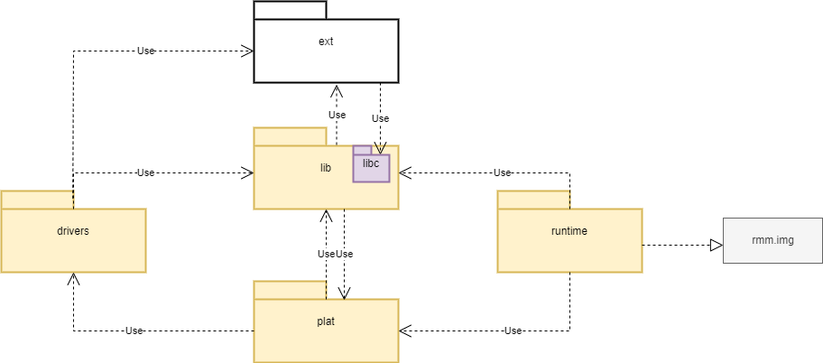

.. SPDX-License-Identifier: BSD-3-Clause
.. SPDX-FileCopyrightText: Copyright TF-RMM Contributors.

.. Custom color scheme for this document
.. raw:: html

    

.. role:: comp

#####################################
RMM Folder and Component organization
#####################################

**********************************
Root Level Folders and Components
**********************************

The root level folder structure of the RMM project is as given below.

::

    ┌── cmake
    ├── configs
    ├── docs
    ├── drivers
    ├── ext
    ├── lib
    ├── plat
    ├── runtime
    ├── toolchains
    └── tools

The RMM functionality is implemented by files in :comp:`lib`, :comp:`ext`,
:comp:`drivers`, :comp:`plat` and :comp:`runtime`. Each of these folders
corresponds to a :comp:`component` in the project. Every component has a
defined role in implementing the RMM functionality and can in-turn be
composed of sub-components of the same role. The components have
their own CMakelists.txt file and a defined public API which is
exported via the public interface of the component to its dependent
users. The :comp:`runtime` component is an exception as it does not
have a public API.

The dependency relationship between the top level components is shown
below :

|Dependency Diagram|

Each component and its role is described below :

* **lib**  : This component is a library of re-usable and architectural
  code which needs to be used by other components.
  The :comp:`lib` component is composed of several sub-components
  and every sub-component has a public API which is exported via its
  public interface. The functionality implemented by the sub-component
  is not platform specific although there could be specific static
  configuration or platform specific data provided via defined public
  interface. All of the sub-components in :comp:`lib` are combined into
  a single archive file which is then included in the build.

  The :comp:`lib` component depends on :comp:`ext` and :comp:`plat`
  components. All other components in the project depend on :comp:`lib`.

* **ext** : This component is meant for external source dependencies of
  the project. The sub folders are external open source projects configured
  as git submodules. The :comp:`ext` component is only allowed to depend on
  libc implementation in :comp:`lib` component.

* **plat** :  This component implements the platform abstraction layer or
  platform layer for short. The platform layer has the following
  responsibilities:

  #. Implement the  platform porting API as defined in platform_api.h.
  #. Do any necessary platform specific initialization in the platform layer.
  #. Initialize :comp:`lib` sub-components with platform specific data.
  #. Include any platform specific drivers from the :comp:`drivers` folder
     and initialize them as necessary.

  Every platform or a family of related platforms is expected to have a
  folder in :comp:`plat` and only one such folder corresponding to the
  platform will be included in the build. The :comp:`plat` component depends
  on :comp:`lib` and any platform specific drivers in :comp:`drivers`.

* **drivers** : The platform specific drivers are implemented in this
  component. Only the `plat` component is allowed to access these drivers
  via its public interface.

* **runtime** : This component implements generic RMM functionality which
  does not need to be shared across different components. The :comp:`runtime`
  component does not have a public interface and is not a dependency for any
  other component. The :comp:`runtime` is compiled into the binary
  ``rmm.img`` after linking with other components in the build.

**********************************
Component File and Cmake Structure
**********************************

The below figure shows the folder organization of a typical
component (or sub-component)

::

    component x
    ├── include
    |   └── public.h
    ├── src
    |   ├── private_a.h
    |   └── src_a.c
    ├── tests
    |   └── test.cpp
    └── CMakeLists.txt

The ``include`` folder contains the headers exposing the public API of the
component. The ``src`` contains the private headers and implementation
of the intended functionality. The ``tests`` contains the tests for the
component and the ``CMakeLists.txt`` defines the build and
inheritance rules.

A typical component ``CMakeLists.txt`` has the following structure :

.. code-block:: CMake

    add_library(comp-x)

    # Define any static config option for this component.
    arm_config_option()

    # Pass the config option to the source files as a compile
    # option.
    target_compile_definitions()

    # Specify any private dependencies of the component. These are not
    # inherited by child dependencies.
    target_link_libraries(comp-x
        PRIVATE xxx)

    # Specify any private dependencies of the component. These are
    # inherited by child dependencies and are usually included in
    # public API header of the component.
    target_link_libraries(comp-x
        PUBLIC yyy)

    # Export public API via public interface of this component
    target_include_directories(comp-x
        PUBLIC "include")

    # Specify any private headers to be included for compilation
    # of this component.
    target_include_directories(comp-x
        PRIVATE "src")

    # Specify source files for component
    target_sources(comp-x
        PRIVATE xxx)

