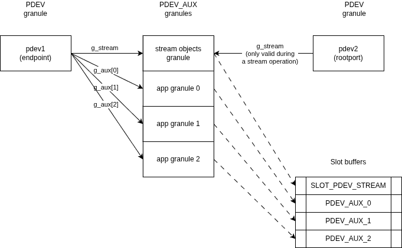

.. SPDX-License-Identifier: BSD-3-Clause
.. SPDX-FileCopyrightText: Copyright TF-RMM Contributors.

#######################
PDEV auxiliary granules
#######################

This document describes how PDEV objects use auxiliary granules, how those
granules relate to PDEV streams, and how the PDEV stream and
RMI_PDEV_COMMUNICATE interact with them. The intent is to provide a high-level
view of the data layout and access patterns.

********
Overview
********

|PDEV stream aux|

Only endpoint PDEV objects own auxiliary granules that are donated by the host
during PDEV creation. In the current implementation a PDEV stream always
connects a rootport and an endpoint PDEV, so stream information is stored in
the endpoint (pdev1) stream objects granule. Auxiliary granules are split into:

- A single "stream objects" granule used to store PDEV stream state.
- The remaining "app" auxiliary granules used as per-instance memory for the
  device-assignment app instance, as described in :doc:`el0-app`.

PDEV auxiliary granules are tracked in the PDEV structure and are mapped into
slot buffers as needed. The stream objects granule is mapped through
``SLOT_PDEV_STREAM``. The app auxiliary granules are mapped as a contiguous
range starting at ``SLOT_PDEV_AUX0``.

***********************
Granule layout and role
***********************

During PDEV creation, the auxiliary granules are:

- Transitioned to the PDEV auxiliary granule state.
- Zeroed and then recorded in the PDEV structure.

The first auxiliary granule (index 0) is reserved for stream objects and holds
an array of per-stream entries.

The remaining auxiliary granules are passed to the device-assignment EL0 app.

************************
PDEV stream interactions
************************

The PDEV stream SMCs operate on stream objects stored in the stream objects
granule. These ABIs receive both pdevs as parameters, so the implementation can
access the granule holding the streams.

At the start of a stream operation, the address of the stream objects granule
is saved in the rootport granule so the rootport can access the stream state
even though the granule was allocated for the endpoint PDEV.

The stream objects granule is always locked before being mapped in all the ABIs
because it is accessed from other PDEVs. The app auxiliary granules are not
locked because they are only used by their owner PDEV.

***************************
PDEV communication workflow
***************************

``smc_pdev_communicate`` uses the PDEV auxiliary granules to support
device-assignment app execution.

For stream-related communication, the workflow is driven by the fields in
``pd->op``:

- ``pd->op.curr`` identifies the operation in progress, such as connect,
  disconnect, key refresh, or stream completion.
- ``pd->op.op_stream_type`` identifies which per-stream entry in the stream
  objects granule belongs to that operation.
- ``pd->op.stream_op_state`` holds the step of the stream handshake while
  ``smc_pdev_communicate`` is executing.

The stream-management SMCs initialize ``pd->op.curr`` and
``pd->op.op_stream_type`` when they start a stream operation. When
``smc_pdev_communicate`` runs for one of those operations, it uses
``pd->op.op_stream_type`` to lock and map the matching stream object from the
auxiliary granule, copies ``stream->op_state`` into
``pd->op.stream_op_state``, and then calls the common communication path.

That communication path advances ``pd->op.stream_op_state`` through the
rootport/endpoint handshake (for example ``START``, ``RP_READY``,
``EP_READY``, and ``RP_CONNECTED``) while ``pd->op.curr`` remains the current
high-level operation. When ``smc_pdev_communicate`` returns, the updated
``pd->op.stream_op_state`` is written back to ``stream->op_state`` before the
stream object is unmapped and unlocked.

