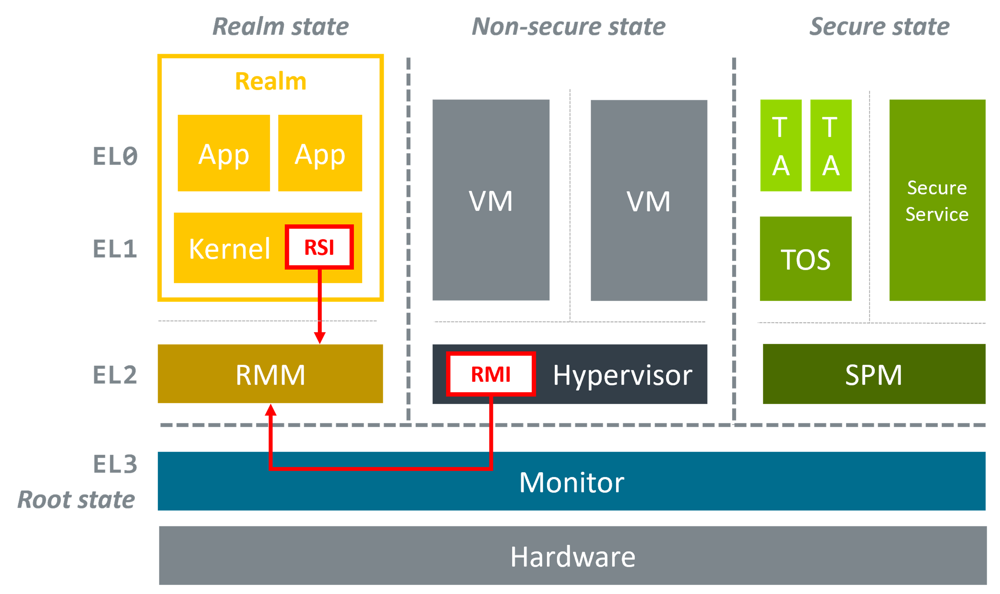

.. SPDX-License-Identifier: BSD-3-Clause
.. SPDX-FileCopyrightText: Copyright TF-RMM Contributors.

.. image:: https://scan.coverity.com/projects/28411/badge.svg
   :target: https://scan.coverity.com/projects/tf-rmm-tf-rmm

.. image:: https://readthedocs.org/projects/tf-rmm/badge/?version=latest
    :target: https://tf-rmm.readthedocs.io/en/latest/?badge=latest
        :alt: Documentation Status

#################
Readme for TF-RMM
#################

`TF-RMM`_ (or simply RMM) is the `Trusted Firmware`_ Implementation of the
`Realm Management Monitor (RMM) Specification`_. The RMM
is a software component that runs at Realm EL2 and forms part of a system
which implements the Arm Confidential Compute Architecture (Arm CCA).
`Arm CCA`_ is an architecture which provides Protected Execution Environments
called Realms.

Prior to Arm CCA, virtual machines have to trust hypervisors that manage them
and a resource that is managed by the hypervisor is also accessible by it.
Exploits against the hypervisors can leak confidential data held in the virtual
machines.  `Arm CCA`_ introduces a new confidential compute environment called
a `Realm`. Any code or data belonging to a `Realm`, whether in memory or in
registers, cannot be accessed or modified by the hypervisor. This means that
the Realm owner does not need to trust the hypervisor that manages the
resources used by the Realm.

The Realm VM is initiated and controlled by the Normal world Hypervisor.
To allow the isolated execution of the Realm VM, a new component called the
Realm Management Monitor (RMM) is introduced, executing at R_EL2. The
hypervisor interacts with the RMM via Realm Management Interface (RMI) to
manage the Realm VM. Policy decisions, such as which Realm to run or what
memory to be delegated to the Realm are made by the hypervisor and communicated
via the RMI. The RMM also provides services to the Realm via the Realm Service
Interface (RSI). These services include cryptographic services and
attestation. The Realm initial state can be measured and an attestation
report, which also includes platform attestation, can be requested via RSI.
The RSI is also the channel for memory management requests from the
Realm VM to the RMM.

The following diagram shows the complete Arm CCA software stack running a
confidential Realm VM :

|Realm VM|

Figure 1. Realm VM execution

The `TF-RMM`_ interacts with the Root EL3 Firmware via the
`RMM-EL3 Communication Interface`_ and this is implemented by the reference
EL3 Firmware implementation `TF-A`_.

More details about the RMM and how it fits in the Software Stack can be
found in `Arm CCA Software Stack Guide`_.

The `Change-log and Release notes`_ has the details of features implemented
by this version of `TF-RMM`_ and lists any known issues.

*******
License
*******

Unless specifically indicated otherwise in a file, `TF-RMM`_ files are provided
under the `BSD-3-Clause License`_. For contributions, please
see `License and Copyright for Contributions`_.

Third Party Projects
====================

The `TF-RMM`_ project requires to be linked with certain other 3rd party
projects and they are to be cloned from their repositories into ``ext`` folder
before building. The projects are `MbedTLS`_, `t_cose`_, `QCBOR`_,
`CppUTest`_ and `libspdm`_. `libspdm`_ repository is fetched during config phase
when RMM_V1_1 build option is enabled.

The project also contains files which are imported from other projects
into the source tree and may have a different license. Such files with
different licenses are listed in the table below. This table is used by the
``checkspdx`` tool in the project to verify license headers.

.. list-table:: **List of files with different license**

   * - File
     - License
   * - lib/libc/src/printf.c
     - MIT
   * - lib/libc/include/stdio.h
     - MIT
   * - lib/libc/src/strlcpy.c
     - ISC
   * - lib/libc/src/strnlen.c
     - BSD-2-Clause
   * - lib/allocator/src/memory_alloc.c
     - Apache-2.0

************
Contributing
************

We gratefully accept bug reports and contributions from the community.
Please see the `Contributor's Guide`_ for details on how to do this.

********************
Feedback and support
********************

Feedback is requested via email to:
`tf-rmm@lists.trustedfirmware.org <tf-rmm@lists.trustedfirmware.org>`__.

To report a bug, please file an `issue on Github`_

-----------------

.. _Realm Management Monitor (RMM) Specification: https://developer.arm.com/documentation/den0137/1-0eac5/?lang=en
.. _Arm CCA: https://www.arm.com/architecture/security-features/arm-confidential-compute-architecture
.. _Arm CCA Software Stack Guide: https://developer.arm.com/documentation/den0127/0100/Overview
.. _TF-A: https://www.trustedfirmware.org/projects/tf-a/
.. _RMM-EL3 Communication Interface: https://trustedfirmware-a.readthedocs.io/en/latest/components/rmm-el3-comms-spec.html
.. _issue on Github: https://github.com/TF-RMM/tf-rmm/issues
.. _MbedTLS: https://github.com/ARMmbed/mbedtls.git
.. _t_cose: https://github.com/laurencelundblade/t_cose
.. _QCBOR: https://github.com/laurencelundblade/QCBOR.git
.. _Change-log and Release notes: https://tf-rmm.readthedocs.io/en/latest/about/change-log.html
.. _BSD-3-Clause License: https://tf-rmm.readthedocs.io/en/latest/about/license.html
.. _License and Copyright for Contributions: https://tf-rmm.readthedocs.io/en/latest/process/contributing.html#license-and-copyright-for-contributions
.. _Contributor's Guide: https://tf-rmm.readthedocs.io/en/latest/process/contributing.html
.. _CppUTest: https://github.com/cpputest/cpputest.git
.. _libspdm: https://github.com/DMTF/libspdm.git
.. _Trusted Firmware: https://www.trustedfirmware.org/
.. _TF-RMM: https://www.trustedfirmware.org/projects/tf-rmm/
